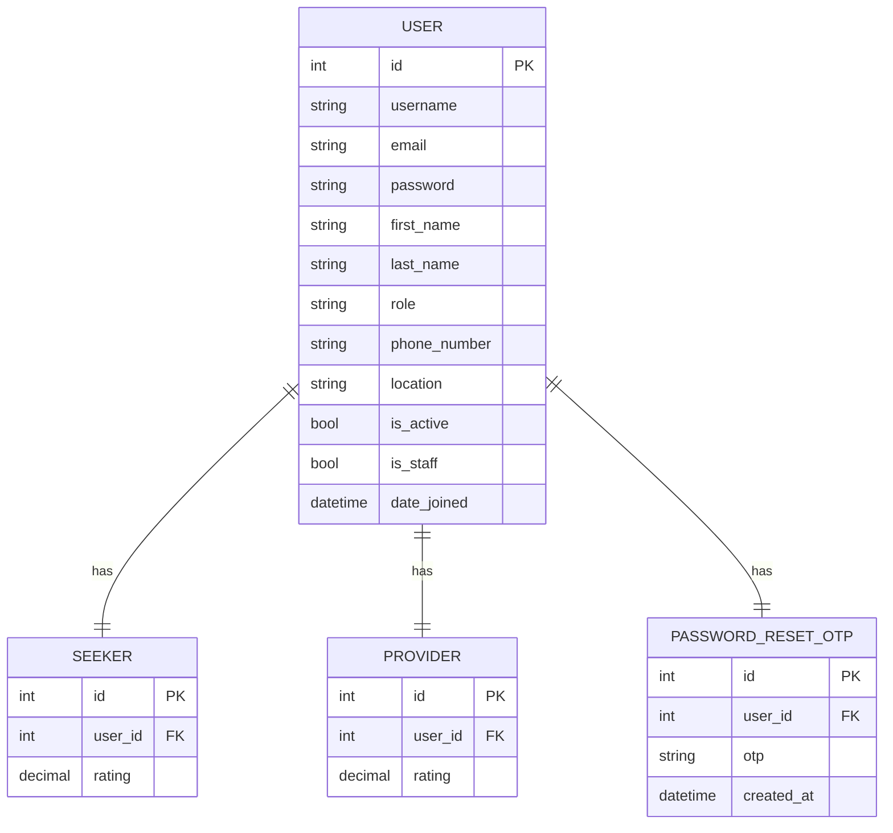

# Accounts Service — Database Schema

```mermaid
erDiagram
    USER {
        int id PK
        string username
        string email
        string password
        string first_name
        string last_name
        string role
        string phone_number
        string location
        bool is_active
        bool is_staff
        datetime date_joined
    }

    SEEKER {
        int id PK
        int user_id FK
        decimal rating
    }

    PROVIDER {
        int id PK
        int user_id FK
        decimal rating
    }

    PASSWORD_RESET_OTP {
        int id PK
        int user_id FK
        string otp
        datetime created_at
    }

    USER ||--|| SEEKER : "has"
    USER ||--|| PROVIDER : "has"
    USER ||--|| PASSWORD_RESET_OTP : "has"
```
