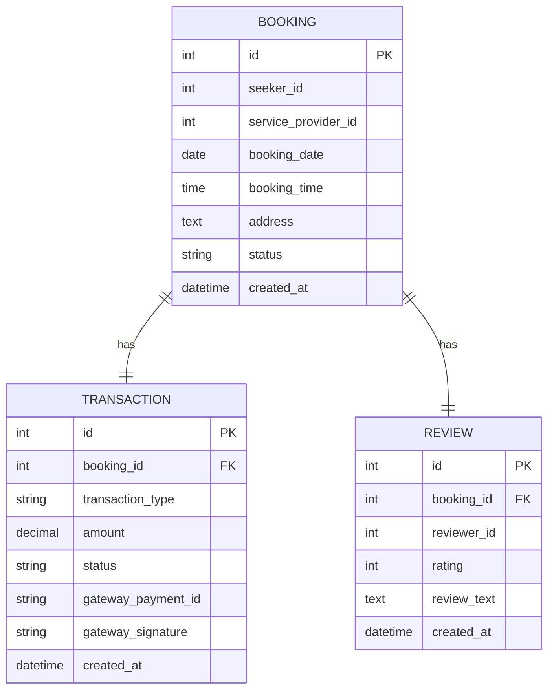

# Bookings Service — Database Schema

```mermaid
erDiagram
    BOOKING {
        int id PK
        int seeker_id
        int service_provider_id
        date booking_date
        time booking_time
        text address
        string status
        datetime created_at
    }

    TRANSACTION {
        int id PK
        int booking_id FK
        string transaction_type
        decimal amount
        string status
        string gateway_payment_id
        string gateway_signature
        datetime created_at
    }

    REVIEW {
        int id PK
        int booking_id FK
        int reviewer_id
        int rating
        text review_text
        datetime created_at
    }

    BOOKING ||--|| TRANSACTION : "has"
    BOOKING ||--|| REVIEW : "has"
```

> `seeker_id`, `service_provider_id`, and `reviewer_id` are cross-service references (no FK constraints).
