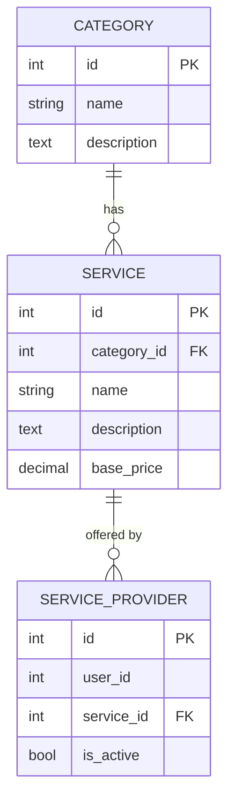

# Services Service — Database Schema

```mermaid
erDiagram
    CATEGORY {
        int id PK
        string name
        text description
    }

    SERVICE {
        int id PK
        int category_id FK
        string name
        text description
        decimal base_price
    }

    SERVICE_PROVIDER {
        int id PK
        int user_id
        int service_id FK
        bool is_active
    }

    CATEGORY ||--o{ SERVICE : "has"
    SERVICE ||--o{ SERVICE_PROVIDER : "offered by"
```

> `user_id` is a cross-service reference to the Accounts service (no FK constraint).
